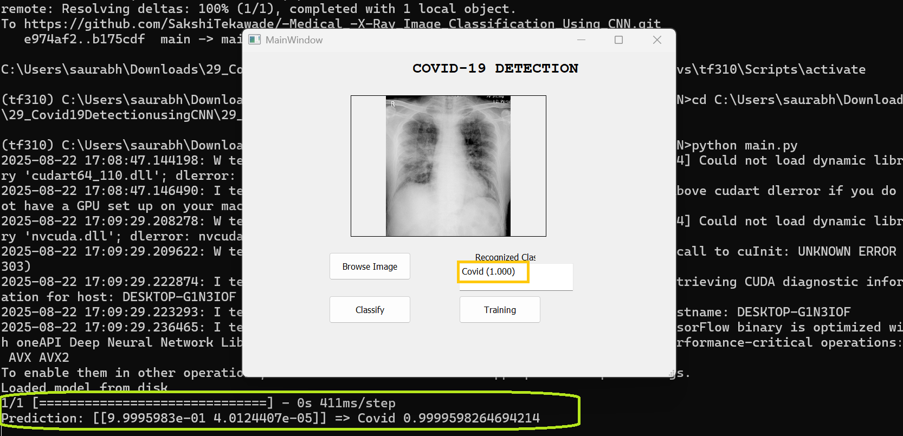

# COVID-19 X-ray Classification (PyQt5 + TensorFlow/Keras)

A desktop application that classifies chest X-ray images as **Covid** or **Normal** using a **Convolutional Neural Network (CNN)** built with TensorFlow/Keras, wrapped in a **PyQt5** GUI.

## Features
- One-click **Training** on your local dataset (handles class imbalance with class weights, data augmentation).
- One-click **Classify** for any image (uses saved `class_indices.json` to map labels correctly).
- **EarlyStopping** + **best-weights checkpoint** to avoid overfitting.
- Prints **evaluation metrics** (accuracy, precision/recall/F1, confusion matrix) on your test set.

---
## Screenshot


---

## Dataset Structure
Organize your data as follows (Keras reads folder names as labels):

```
TrainingDataset/
    Covid/
        img001.jpg
        ...
    Normal/
        img002.jpg
        ...
TestingDataset/
    Covid/
        ...
    Normal/
        ...
```

> **Note:** Datasets are **not committed** to Git. Keep them locally or in cloud storage.

---

## Environment (Windows, CPU)
Use Python **3.10** with a virtual environment named `tf310` (TensorFlow 2.10 compatible).

```bat
py -3.10 -m venv C:
envs	f310
C:
envs	f310\Scripts ctivate
pip install --upgrade pip
pip install -r requirements.txt
```

### What `(tf310)` means
When your prompt shows `(tf310)`, you are using your isolated environment; `python` and `pip` commands run inside it.

---

## Configure Paths
In `main.py`, set these constants to your local dataset paths:

```python
TRAIN_DIR = r"C:\path\to\TrainingDataset"
TEST_DIR  = r"C:\path\to\TestingDataset"
```

---

## Run
```bat
C:
envs	f310\Scripts ctivate
cd C:\path	o\project
python main.py
```

- Click **Training** once (or whenever the dataset changes).
- After training, click **Browse Image** → pick an X-ray → **Classify**.

---

## Troubleshooting
- **All predictions = Normal**: ensure `class_indices.json` exists (from training) and is loaded at inference; use class weights; increase epochs.
- **DLL / TensorFlow import errors**: use Python 3.10 + TensorFlow 2.10; install `numpy==1.23.5`.
- **ModuleNotFoundError (PyQt5/numpy)**: activate `(tf310)` before installing/running.
- **Large model files**: do **not** commit `*.h5` to Git. Either ignore them (default) or use Git LFS.

---

## Tech Stack
- **Python 3.10**, **TensorFlow/Keras 2.10**, **PyQt5 5.15**
- **NumPy**, **scikit-learn**, **OpenCV**, **SciPy**, **mahotas** (optional), **imutils** (optional)

---

## License
Choose a license (e.g., **MIT**) in GitHub → *Add file* → *Create new file* → `LICENSE` (GitHub provides ready-made templates).
